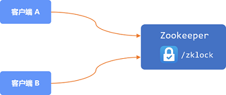
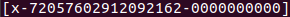
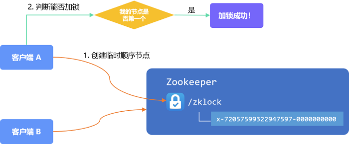
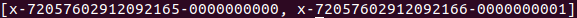
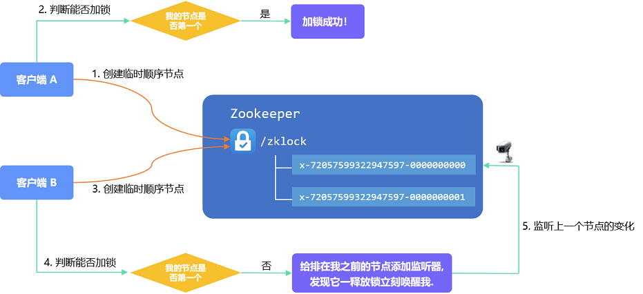
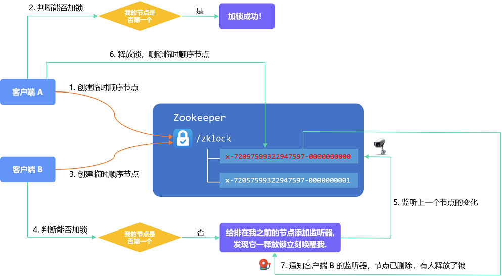
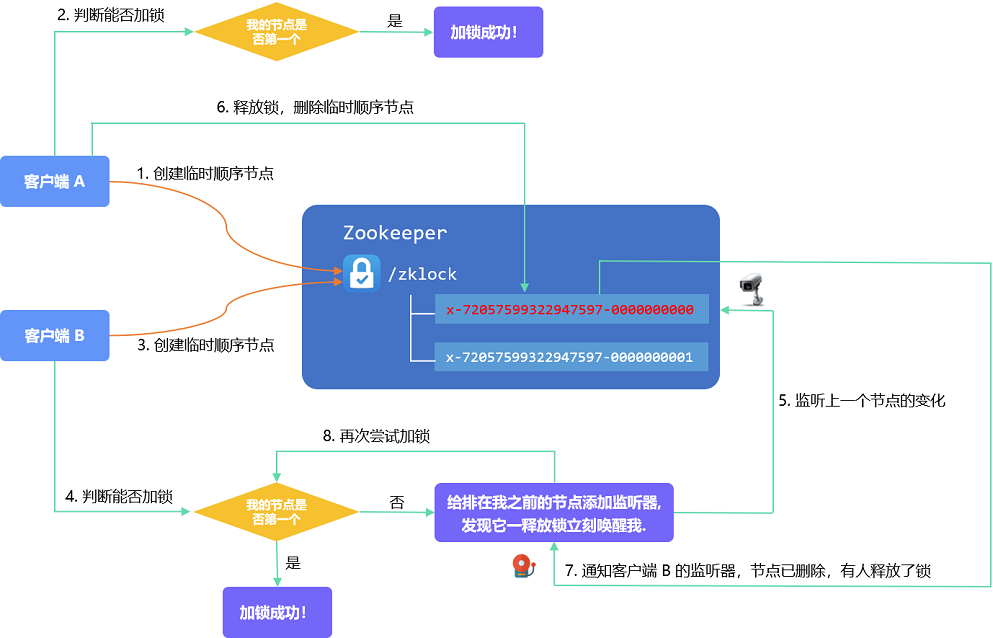
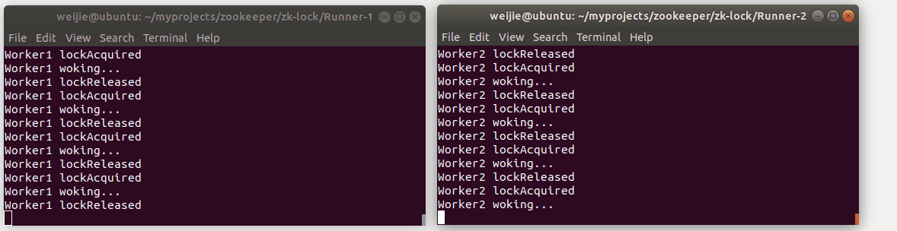

# zookeeper 分布式锁的原理及实现

## zookeeper 分布式锁原理

为了防止分布式系统中的多个进程之间相互干扰，我们需要一种分布式协调技术来对这些进程进行调度。而这个分布式协调技术的核心就是分布式锁。

利用 zookeeper 的顺序临时节点，可以很方便地实现分布式锁和等待队列。毕竟 zookeeper 设计的初衷，就是为了实现分布式锁服务的。

如果有客户端 A 和客户端 B 争抢一把分布式锁，会是一番怎样的景象？

两个客户端的加锁请求总有个先来后到吧，我们不妨假设客户端 A 的请求先到达。

zookeeper 接到请求后，会首先创建相应的锁节点 dir（例如 /zklock），然后在此目录下为客户端 A 创建一个  **临时顺序节点** ，临时顺序节点是 zookeeper 的 4 种节点类型之一，大概长这样：

其命名格式一般遵循如下规范： x - { session id } - { 自动递增编号 }

因为客户端 A 的请求是第一个到达的，所以分配给 A 的自动递增编号是一串 0，在此之后的请求，编号会顺序递增。

创建临时顺序节点不等于将锁分配给了客户端 A。判别能否获得锁的办法是  **客户端的节点编号是否在 /zklock 路径下的节点编号队列中排在队首**  ，因为目前只有客户端 A 发起了加锁请求，A 顺利获得锁。

此时客户端 B 的加锁请求到达，zookeeper 同样会在 /zklock 路径下为它创建一个临时顺序节点。

由于客户端 A 的锁尚未释放，所以此时 /zklock 路径下会存在两个临时顺序节点：

然后客户端 B 判断是否可以加锁，此时发现自己的顺序节点并不在队首，加锁失败了。

那就耐心等待吧，等到什么时候呢，等到排在我前面的那个节点释放锁呗。

为了在第一时间获悉 A 节点的变化情况，B 向 A 节点注册了监听器。

A 在一顿操作之后，释放了锁，同时删除了自己的临时顺序节点。

这一消息在第一时间通过监听器通知到了客户端 B：你监听的那个节点已经删除了，有人释放了锁。

于是客户端 B 再次判断自己是否满足加锁条件：

自己的编号是 01，排在 /zklock 路径下顺序节点队列队首，加锁成功！

## zookeeper 分布式锁实现

我们尝试基于 zookeeper 实现分布式锁，实现两个客户端 Worker1 和 Worker2 的协同工作。以巩固上述知识点。

效果如下图，Worker1 和 Worker2 会竞争同一个分布式锁，获得锁之后完成各自的工作。

Worker1 一顿操作释放锁 （Worker1 lockReleased）之后，会立刻唤醒 Worker2 （ Worker2 lockAcquired），而在此之前 Worker2 只能等待。

Worker2 一顿操作释放锁之后，会立刻唤醒排在它之后的节点，以此类推。

